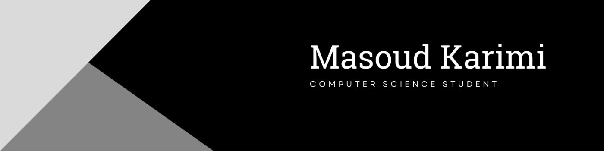

## Hi, I'm Masoud 👋
I'm a Computer Science graduate from the University of Ottawa with experience across machine learning, data science, software engineering, and applied research. I like working on problems where ML has a practical use, especially in biomedical and scientific settings.

I've worked on deep learning with cancer RNA-seq data, including model evaluation, feature selection, and interpretability. On the industry side, I've worked at Ericsson in software test development and applied ML, building Python-based pipelines, computer vision workflows, model experimentation tools, and cloud/MLOps infrastructure for hosting and deploying models. I've also worked in data analytics, building ETL workflows, automations, SQL analyses, and dashboards.

I enjoy both sides of ML: experimenting with models and understanding how they behave, but also building the software and pipelines that make them reproducible and useful.

### Interests

- Machine learning for biomedical and healthcare data
- Deep learning and representation learning
- Trustworthy and interpretable ML
- Uncertainty and robustness
- Medical imaging and computer vision
- Genomics and high-dimensional biological data
- MLOps, reproducible ML, and open-source software

